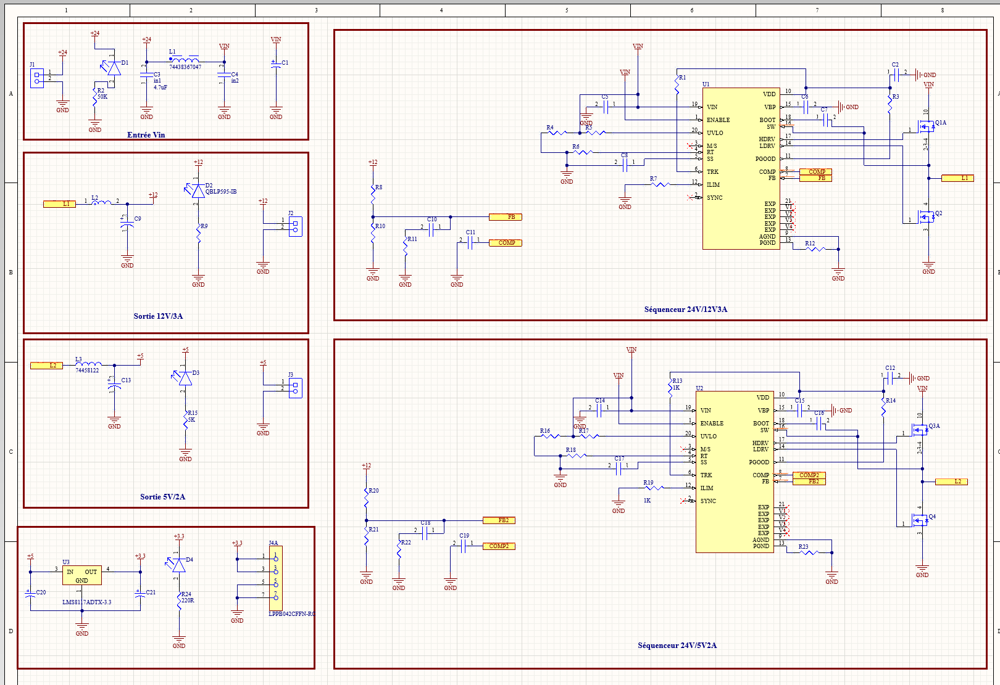
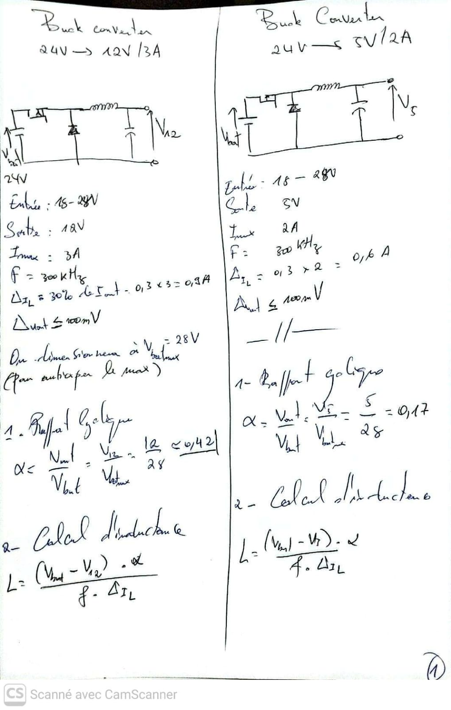
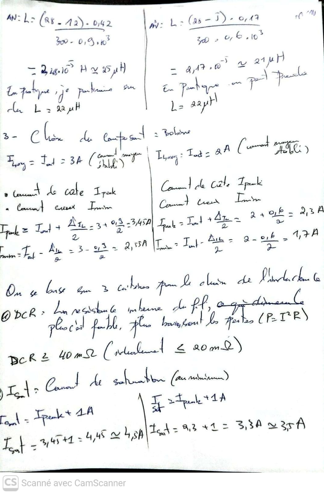
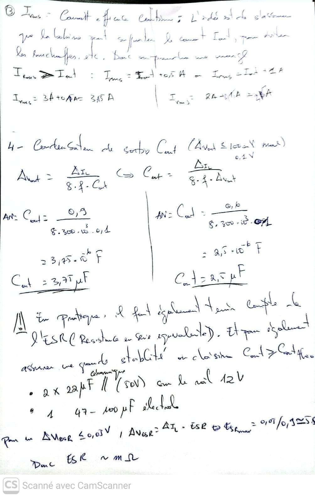
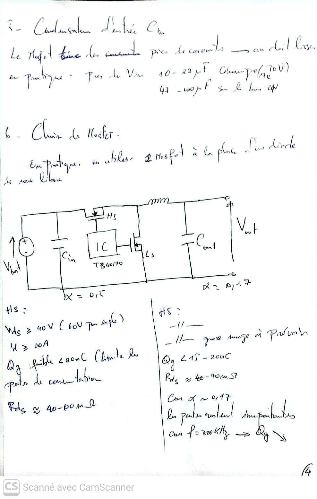
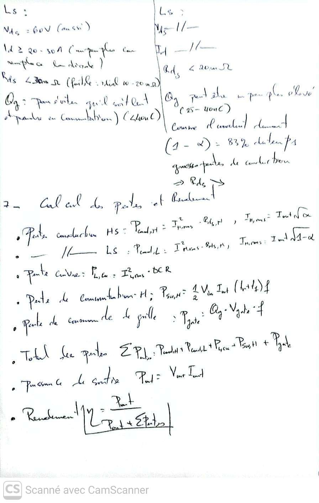
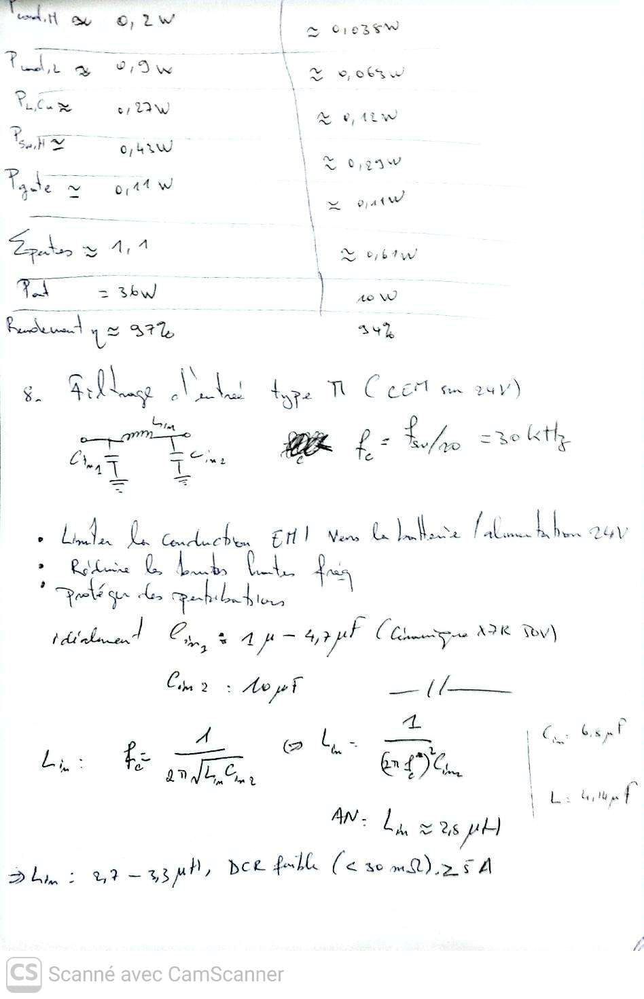
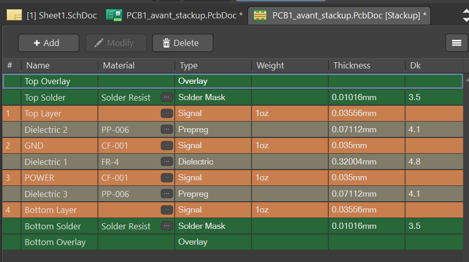

# Convertisseur Buck synchrone multi-sorties

## 24 V DC → 12 V / 3 A, 5 V / 2 A et 3,3 V / 1 A


Projet de conception d’une alimentation DC-DC multi-sorties basée sur une entrée de 24 V DC. La carte a été étudiée pour fournir trois rails de tension régulés :

- 12 V / 3 A
- 5 V / 2 A
- 3,3 V / 1 A

Le projet couvre le dimensionnement électrique, l’étude de convertisseurs Buck et Boost, la conception du schéma, le routage du PCB sous Altium Designer, la définition des largeurs de pistes, l’étude du stack-up et l’export du modèle 3D de la carte.

---

## Vue d’ensemble

| Paramètre | Valeur |
|---|---|
| Entrée | 24 V DC |
| Sortie 1 | 12 V / 3 A |
| Sortie 2 | 5 V / 2 A |
| Sortie 3 | 3,3 V / 1 A |
| Topologie principale | Buck synchrone |
| Fréquence étudiée | 300 kHz |
| Contrôleur / séquenceur | TPS40170 |
| Logiciel de conception | Altium Designer |
| Modèle mécanique | STEP 3D |
| Domaine | Électronique de puissance et conception PCB |

---

## Objectifs du projet

- Convertir une alimentation 24 V vers plusieurs rails régulés.
- Étudier et dimensionner des convertisseurs Buck et Boost.
- Concevoir une architecture Buck synchrone autour du TPS40170.
- Adapter les largeurs de pistes aux courants attendus.
- Organiser le placement et le routage des composants de puissance.
- Documenter la conception du PCB et son empilage.
- Exporter la carte au format STEP pour une future intégration mécanique.

---

## Architecture électrique

La conversion principale repose sur une topologie Buck synchrone.

Le contrôleur TPS40170 commande deux interrupteurs de puissance :

- Un MOSFET high-side relié à l’entrée 24 V.
- Un MOSFET low-side utilisé à la place de la diode de roue libre.

L’inductance assure le transfert et le lissage de l’énergie. Les condensateurs d’entrée et de sortie réduisent les ondulations de tension et de courant.

Cette architecture est adaptée à la génération de plusieurs rails d’alimentation pour des systèmes embarqués, des circuits analogiques, des capteurs et des charges numériques.

---

## Schéma électronique

Le schéma électronique complet est disponible ici :



Le schéma présente notamment :

- Le contrôleur TPS40170.
- Les étages de commutation.
- Les inductances de puissance.
- Les condensateurs d’entrée et de sortie.
- Les rails 12 V, 5 V et 3,3 V.
- Les réseaux de retour et de régulation.
- Les connecteurs d’entrée et de sortie.

Le fichier source du schéma Altium est également conservé dans :

```text
hardware/manufacturing/drill-files/Sheet1.SchDoc
```

---

## Calculs de dimensionnement

Les calculs ont été réalisés avant la conception du PCB. Ils servent de base au choix des composants et à la vérification de l’architecture.

Les documents sont disponibles dans :

```text
01_calculs/
```

Ils comprennent six pages de calculs manuscrits couvrant notamment :

- L’étude des convertisseurs Buck.
- L’étude des convertisseurs Boost.
- Le rapport cyclique.
- Le dimensionnement des inductances.
- Le calcul des courants.
- Le choix des condensateurs.
- L’analyse des tensions d’entrée et de sortie.
- Les grandeurs nécessaires au dimensionnement des pistes.

### Pages de calculs












---

## Conception du PCB

Le PCB a été conçu avec Altium Designer en tenant compte de la circulation de l’énergie entre l’entrée, les étages de conversion et les sorties régulées.

### Vues du PCB

#### Vue de la couche supérieure


#### Rendu 3D de la carte


#### Vue arrière du PCB


#### Vue d’une couche interne


---

## Largeur des pistes

Les largeurs de pistes ont été définies selon le courant associé à chaque rail.

| Rail | Courant maximal | Largeur configurée ou étudiée |
|---|---:|---:|
| 24 V vers l’étage de puissance | 3 A | Jusqu’à 2 mm |
| Sortie 12 V | 3 A | Environ 1,2 mm |
| Sortie 5 V | 2 A | Environ 1 mm |
| Sortie 3,3 V | 1 A | Environ 0,5 mm |
| Signaux faibles | < 100 mA | Environ 0,25 à 0,30 mm |

Les captures des paramètres Altium sont conservées dans :

```text
hardware/manufacturing/drill-files/
```

### Paramètres de largeur par réseau


---

## Empilage du PCB

Le stack-up décrit l’empilage des couches utilisées pour la carte.



L’étude du stack-up permet de documenter :

- Les couches de cuivre.
- Les couches de routage.
- Les plans d’alimentation et de masse.
- Les couches diélectriques.
- L’épaisseur de la carte.
- Les contraintes liées au routage et à la fabrication.

---

## Modèle 3D STEP

Un modèle 3D de la carte a été exporté au format STEP pour permettre une future intégration mécanique dans un boîtier ou un système mécatronique.

- [Télécharger le modèle 3D STEP du PCB](hardware/exports/PCB1_step%203D.step)

Le modèle peut être ouvert avec un logiciel de CAO compatible avec le format STEP, comme FreeCAD, SolidWorks ou Fusion 360.

---

## Documentation du TPS40170

Le dossier `docs/datasheets/` contient :

- Le datasheet complet du TPS40170-EP.
- Une image du schéma d’application du séquenceur.

### Schéma d’application du TPS40170


### Datasheet complet

- [Consulter le datasheet TPS40170-EP](docs/datasheets/TPS40170-EP.PDF)
- [Datasheet officiel Texas Instruments](https://www.ti.com/lit/ds/symlink/tps40170.pdf)

Le datasheet sert de référence pour :

- Le fonctionnement du contrôleur.
- Le pilotage des MOSFETs.
- Le dimensionnement des composants externes.
- La fréquence de découpage.
- Les réglages de régulation.
- Les recommandations de conception du convertisseur synchrone.

---

## Sources Altium et fichiers de conception

Les fichiers de conception sont conservés dans :

```text
hardware/manufacturing/drill-files/
```

Ils comprennent notamment :

- Le fichier PCB Altium.
- Le fichier de schéma Altium.
- Les captures des paramètres de conception.
- Les images liées au routage et aux largeurs de pistes.

Ces fichiers permettent de retrouver la logique de conception et de poursuivre les modifications dans Altium Designer.

---

## Structure du repository

```text
.
├── 01_calculs/
│   ├── 1.png
│   ├── 2.png
│   ├── 3.png
│   ├── 4.png
│   ├── 5.png
│   └── 6.png
│
├── assets/
│   └── images/
│       ├── image (1).png
│       ├── image (2).png
│       ├── image (3).png
│       ├── image (4).png
│       └── schema.png
│
├── docs/
│   └── datasheets/
│       ├── sequenceur TPS40170.png
│       └── TPS40170-EP.PDF
│
├── hardware/
│   ├── exports/
│   │   └── PCB1_step 3D.step
│   │
│   └── manufacturing/
│       ├── drill-files/
│       │   ├── _Previews/
│       │   ├── image (1).png
│       │   ├── image (2).png
│       │   ├── image (3).png
│       │   ├── image (4).png
│       │   ├── image (5).png
│       │   ├── largeur des pistes.png
│       │   ├── PCB1_avant_stackup.PcbDoc
│       │   └── Sheet1.SchDoc
│       │
│       └── pick-and-place/
│           └── stackup.png
│
└── README.md
```

---

## État du projet

**Conception et documentation réalisées.**

Le repository contient les calculs, le schéma, les vues du PCB, le modèle STEP, la documentation du TPS40170 et les fichiers de conception associés.

Les prochaines étapes consistent à :

- Vérifier les règles DRC du PCB.
- Finaliser et contrôler les fichiers de fabrication.
- Vérifier les empreintes et la BOM.
- Fabriquer un premier prototype.
- Mesurer les tensions de sortie et les ondulations.
- Caractériser le rendement.
- Mesurer l’échauffement des composants de puissance.
- Documenter les résultats de validation.

---

## Compétences mobilisées

- Électronique de puissance.
- Convertisseurs Buck et Boost.
- Topologie Buck synchrone.
- Dimensionnement de composants.
- Conception de schémas électroniques.
- Altium Designer.
- Routage PCB.
- Définition des largeurs de pistes.
- Stack-up PCB.
- Préparation de fichiers de fabrication.
- Export STEP.
- Intégration électronique et mécanique.

---

## Auteur

**Joseph Mbode**

Ingénieur systèmes embarqués, électronique et conception de cartes électroniques.

- LinkedIn : [Joseph Mbode](https://www.linkedin.com/in/joseph-mbode)
- GitHub : [@Josephulrich](https://github.com/Josephulrich)
